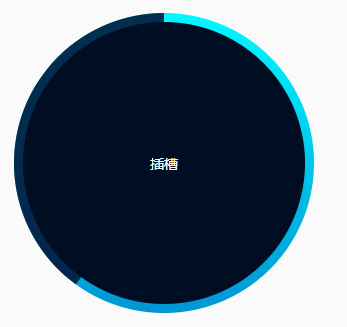

# 带有动画效果的圆环进度条

## 效果：



## 用法：

```javascript
/**
* 说明：进度百分比
* 类型：数字、字符串
* 默认值：0
* 是否必填：否
* 可选值：0-100
*/
percentNum: {
	type: [String, Number],
	required: false,
	default: 0,
},
/**
* 说明：动画加载速度
* 类型：数字、字符串
* 默认值：4
* 是否必填：否
* 可选值：推荐2-5
*/
speed: {
	type: [String, Number],
	required: false,
	default: 4,
},
```

### 其它配置：

1、设置进度条颜色

2、设置进度条宽度